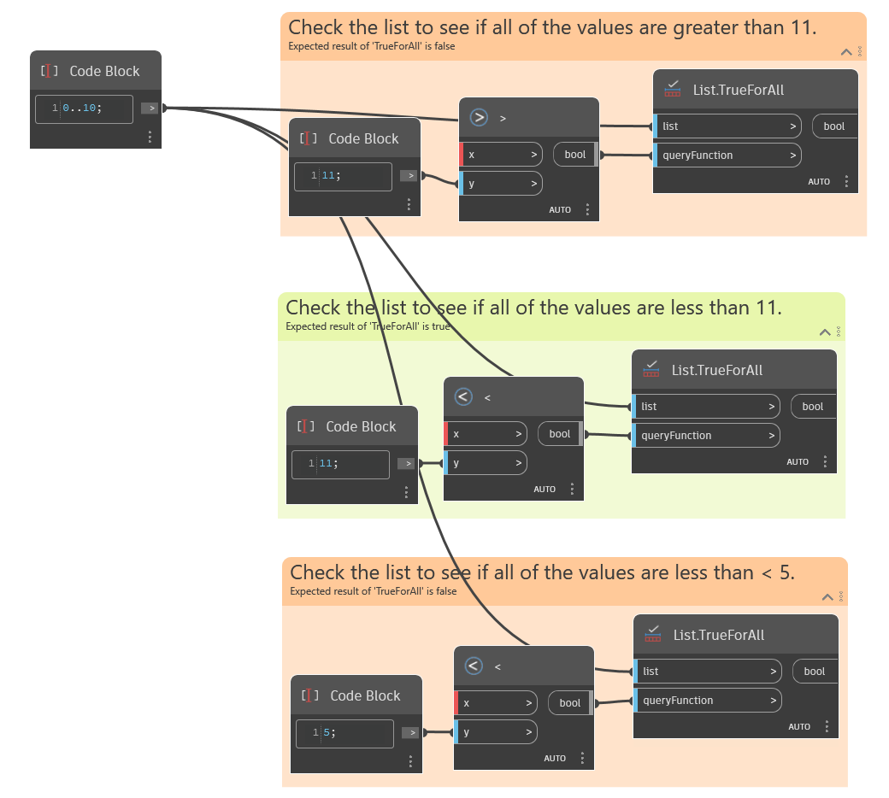

## In Depth
`List.TrueForAll` returns a Boolean value showing if the condition in the `queryFunction` input is True for all items on the list. The `queryFunction` input must be a Boolean. 

The example below shows three functions being used to evaluate an input list. The first uses a greater than (>) node to evaluate if all values in the list are greater than 11, which returns False. The second uses a less than (<) node to evaluate if all the values in the list are less than 11, which returns True. The third uses a less than (<) node to evaluate if all the values in the list are less than 5, which returns False.
___
## Example File

