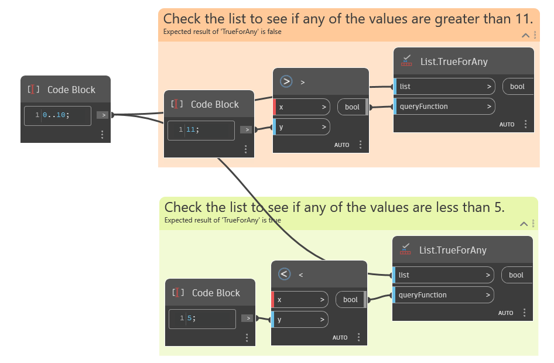

## In Depth
`List.TrueForAny` returns a Boolean value showing if the condition in the `queryFunction` input is True for at least one item on the list. The `queryFunction` input must be a Boolean.

The example below shows two functions being used to evaluate an input list. The first uses a greater than (>) node to evaluate if any of the list values are greater than 11, which returns False. The second uses a less than (<) node to evaluate if any of the list values are less than 5, which returns True.
___
## Example File

