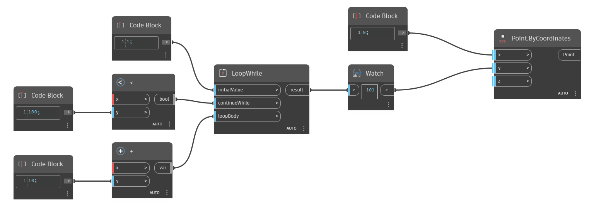

## In Depth
`LoopWhile` returns the result of a looped function until the constraints are met. 

In the example below, a simple loop is created to add 10, starting with 1, until the result is larger than 100. `LoopWhile` accepts variables for its `initialValue` input and functions for the `continueWhile` and `loopBody` inputs. `continueWhile` defines the constraints of the loop, which in this example is a Less Than function and an argument of 100. `loopBody` defines what the loop does, which in this example is an Add function with an argument of 10.
___
## Example File

