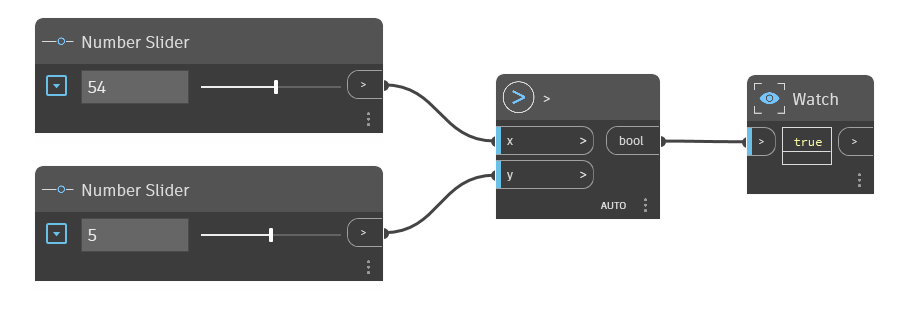

## In Depth
The `>` node is the Greater Than operator. If the `x` input is greater than the `y` input, it returns True. If `x` is less than `y`, or if the two values are equal, it returns False. In the example below, a `>` node is used to determine if the `x` input is greater than the `y` input. We use two number sliders to control the inputs to the `>` operator.
___
## Example File

