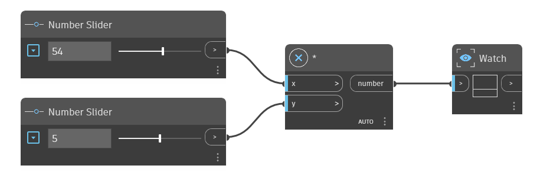

## In Depth
The `*` node is the multiplication operator. It returns the product of the two input numbers. In the example below, a `*` node is used to multiply x times y. We use two number sliders to control the inputs to the `*` operator.
___
## Example File

