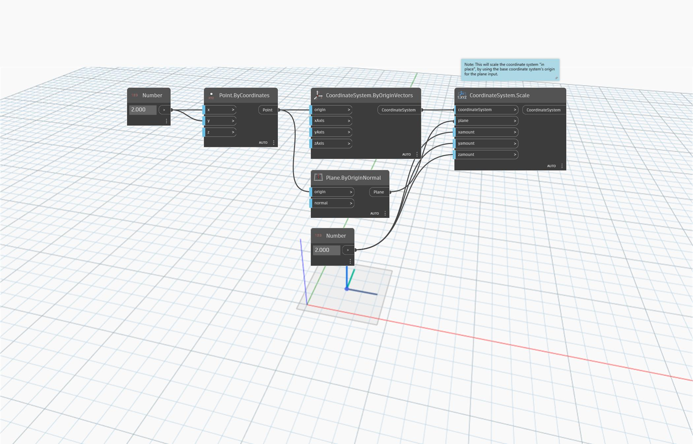

<!--- Autodesk.DesignScript.Geometry.CoordinateSystem.Scale(coordinateSystem, plane, xamount, yamount, zamount) --->
<!--- NE2FY5VUCEZ5FDNQJAZD74HKN3WQSOQJXNOQ77SK3PFIJQCTF23Q --->
## In Depth
`CoordinateSystem.Scale (coordinateSystem, plane, xamount, yamount, zamount)` scales a coordinate system non-uniformly around a given plane. The coordinate system is scaled in place by using the base coordinate system’s origin for the plane input.
___
## Example File

