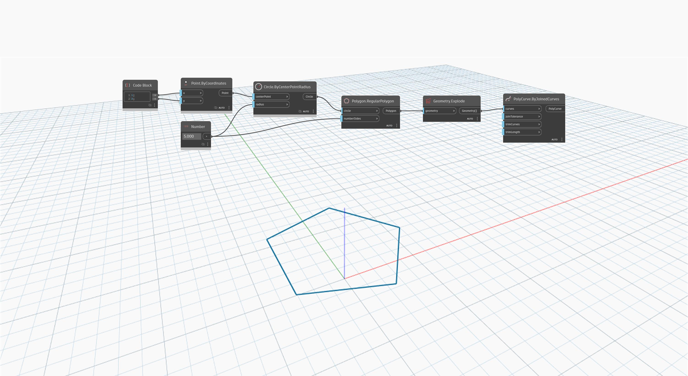

<!--- Autodesk.DesignScript.Geometry.PolyCurve.ByJoinedCurves(curves, joinTolerance, trimCurves, trimLength) --->
<!--- NHC5UY7UTB4NA5X3EXEIVOE3EOF7CFAXOVVAHYJ7ZSKC76OLPPYA --->
## In Depth
`PolyCurve.ByJoinedCurves` creates joined curves from a set of curves with matching vertices. You can determine the permissible size of the gap between curves to be joined with the ‘joinTolerance` input.

In the example below, a `Polygon.RegularPolygon` is exploded into a curve list and is then rejoined into a PolyCurve.
___
## Example File

