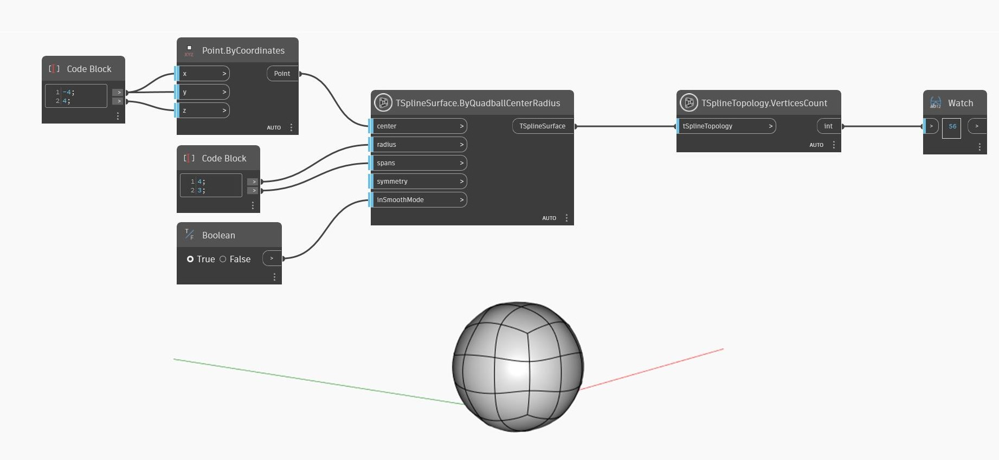

<!--- Autodesk.DesignScript.Geometry.TSpline.TSplineTopology.VerticesCount --->
<!--- OUBDJTXQVGIEZZTOCO3QDFCDT73JUQD54U6YYFBJZUKZDZEYPYKA --->
## In Depth
In the example below, a `TSplineTopology.VerticesCount` node is used to return the number of vertices of a quadball T-Spline surface.
___
## Example File

