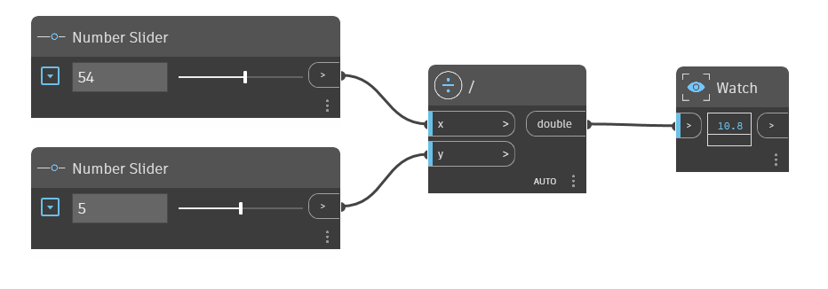

## In Depth
The `/` node is the division operator. It returns the result of the `x` input divided by the `y` input. In the example below, a `/` node is used to divide the `x` input by the `y` input. We use two number sliders to control the inputs to the `/` operator.
___
## Example File

