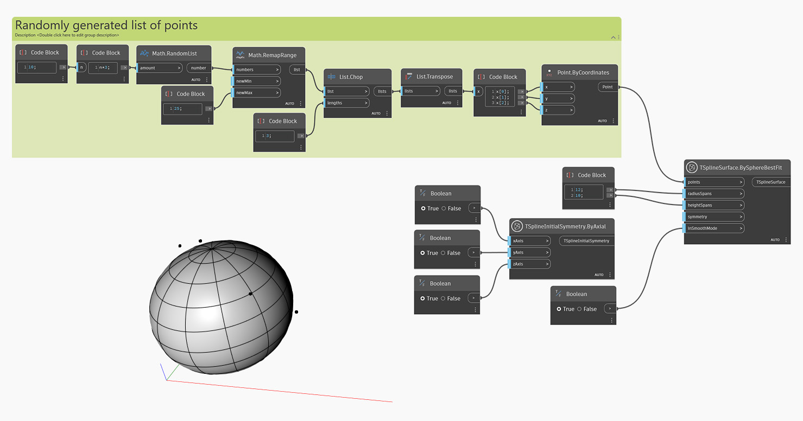

<!--- Autodesk.DesignScript.Geometry.TSpline.TSplineSurface.BySphereBestFit --->
<!--- RUAGD4YGKJ6XHPIKDL7GZX63CDAFMI6KUSR6XMXEBGJJOATEI5IA --->
## In-Depth
In the example below, a T-Spline sphere primitive surface is created using the `TSplineSurface.BySphereBestFit` node from a provided list of random points. `radiusSpans` and `heightSpans` inputs control the number of faces along the height and radial spans (or meridians). The `symmetry` input controls if the shape has initial symmetry and, finally, `inSmoothMode` defines if the preview is in smooth or box mode.

## Example File

