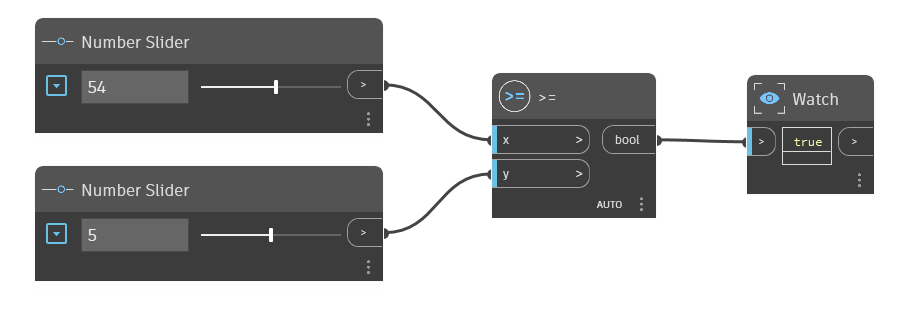

## In Depth
The `>=` node is the Greater Than Or Equal To operator. If the `x` input is greater than the `y` input, or if the two values are equal, Exists in 1.x dictionary; edited Graph name: GreaterThanOrEqualTo.dyn Y

it returns True. If `x` is less than `y`, this operator returns False. In the example below, a `>=` node is used to determine if the `x` input is greater than or equal to the `y` input. We use two number sliders to control the inputs to the `>=` operator.
___
## Example File

