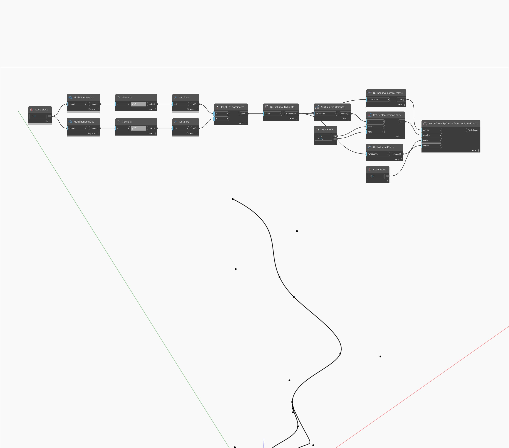

<!--- Autodesk.DesignScript.Geometry.NurbsCurve.ByControlPointsWeightsKnots --->
<!--- T6GEU2COB3ZCMHPIT6WYQEY7NOLFALMOFIPSGLNKU5GNGESBEB7Q --->
## In Depth
`NurbsCurve.ByControlPointsWeightsKnots` allows us to manually control the weights and knots of a NurbsCurve. The list of weights should be the same length as the list of control points. The size of the list of knots must be equal to the number of control points plus the degree plus 1. 

In the example below, we first create a NurbsCurve by interpolating between a series of random points. We use knots, weights, and control points to find the corresponding parts of that curve. We can use `List.ReplaceItemAtIndex` to modify the list of weights. Finally, we use `NurbsCurve.ByControlPointsWeightsKnots` to recreate a NurbsCurve with the modified weights.

___
## Example File

