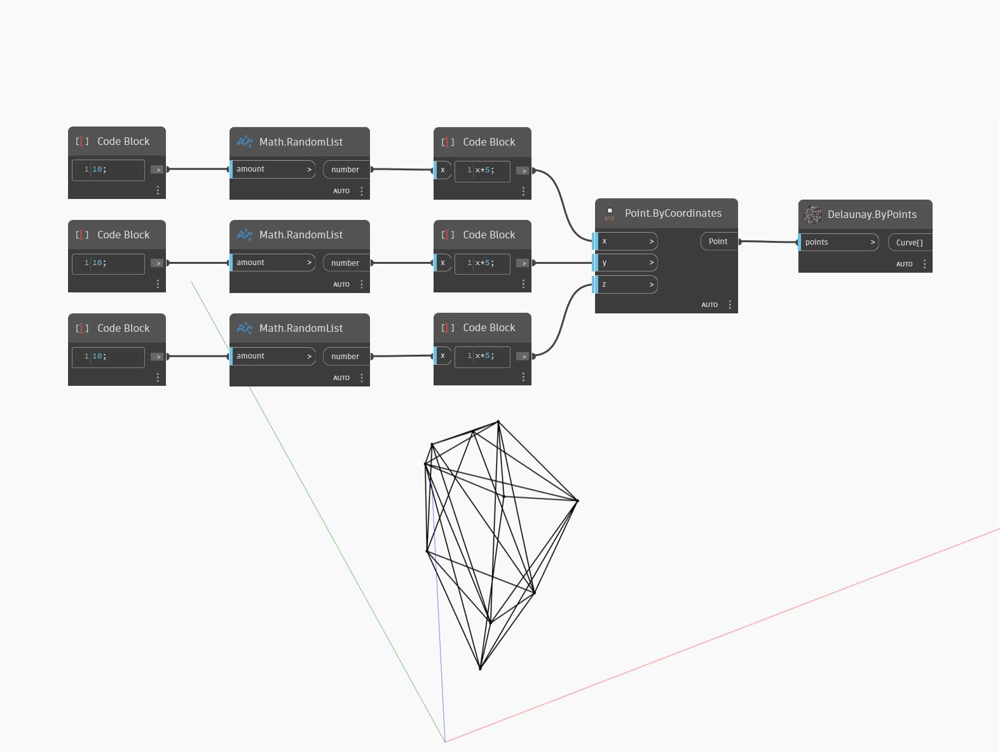

## In Depth
`Delaunay.ByPoints` returns a list of curves that represent the Delaunay triangulation of a set of points. 

In the example below, a list of points randomly placed in 3D returns a list of curves representing their Delaunay triangulation.

___
## Example File

