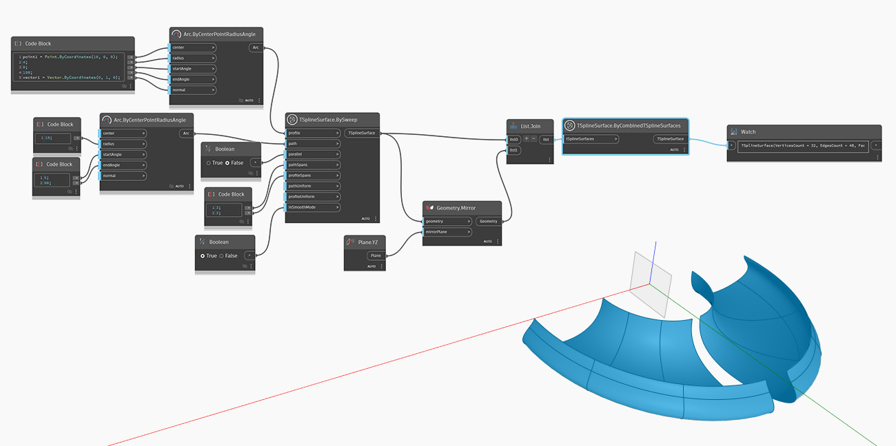

<!--- Autodesk.DesignScript.Geometry.TSpline.TSplineSurface.ByCombinedTSplineSurfaces --->
<!--- U35TWGXYHIE46AYX3QP45IXNCZJAFUT62AN4GKHWSYFDMJWZ2WZQ --->
## In Depth
In the example below, a new T-Spline surface is created from two surfaces mirrored around an axis. The surfaces don't have to be joining. The output of the node is a single T-Spline surface, even if it appears to have two topologically distict parts. 

## Example File

