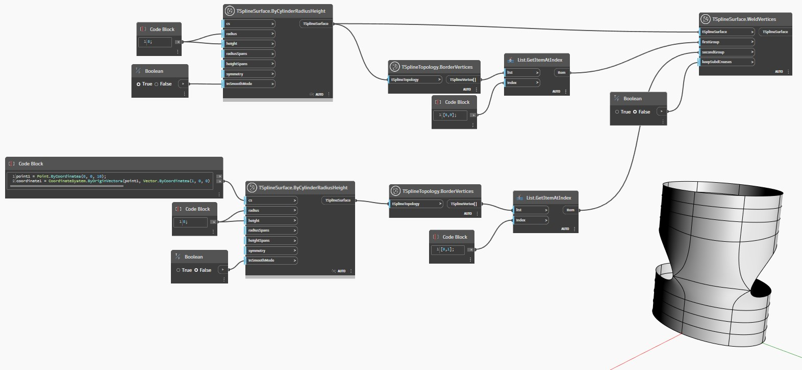

## In Depth
In the example below, two T-Spline cylinder surfaces are positioned one above the other. Two vertices are selected from each surface and used as input for the `TSplineSurface.WeldVertices` node. The group of vertices provided as `firstGroup` input remains in place while the `secondGroup` of vertices are displaced to perform the weld operation. Optionally, `keepSubdCreases` input controls if the edge along the weld is creased. 
___
## Example File

