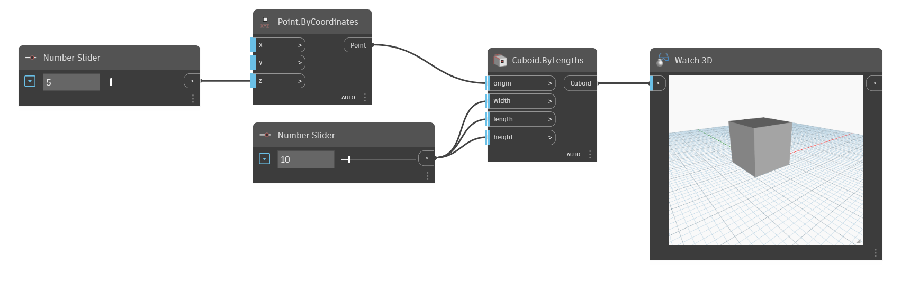

<!--- Autodesk.DesignScript.Geometry.Cuboid.ByLengths(origin, width, length, height) --->
<!--- VK63GH4YGTA23CXGPUEJO47L6TRGFRG7QY64LCFRO6C5G6UFK4PA --->
## In Depth
This Cuboid By Lengths allows the user to input an origin point for the center of the cuboid, as well as the length, width and height of the cuboid. 
___
## Example File

