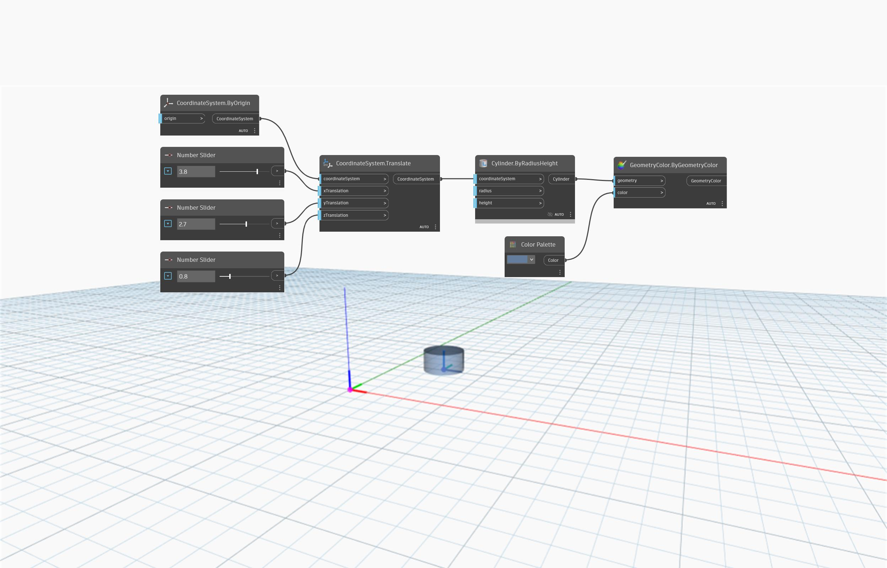

<!--- Autodesk.DesignScript.Geometry.CoordinateSystem.Translate(coordinateSystem, xTranslation, yTranslation, zTranslation) --->
<!--- WC63DIVH2PMDYNEMXAKVSTWOLAWHKDASMASHVO3GK3SW7CAXFLDA --->
## In Depth
`CoordinateSystem.Translate (coordinateSystem, xTranslation, yTranslation, zTranslation)` returns a new CoordinateSystem. Its location is based on translation distances in the X, Y, and Z directions. 

In the example below, a new CoordinateSystem is returned from translation distances of 3.8 on the X axis, 2.7 on the Y axis, and 0.8 on the Z axis. The new CoordinateSystem is identified with a cylinder created on it.

___
## Example File

