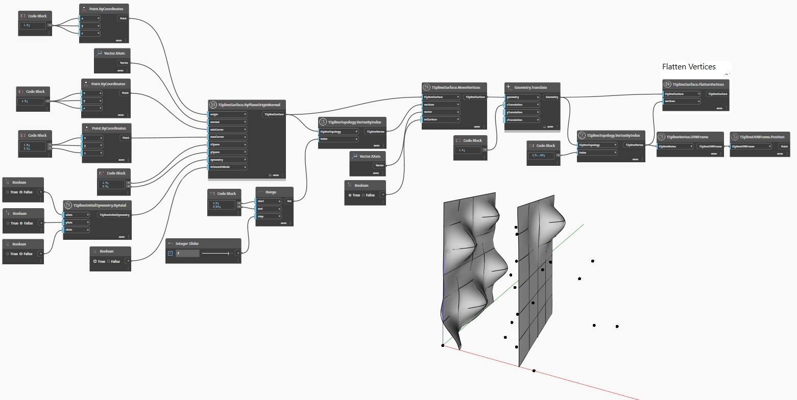

## In Depth
In the example below, `TSplineTopology.VertexByIndex` is used to display a list of vertices on a planar T-Spline surface. 
The surface presents extruded vertices, some of which are then flattened using the `TSplineSurface.FlattenVertices(vertices)` node.
The nodes `TSplineVertex.UVNFrame` and `TSplineUVNFrame.Position` are used to highlight the vertices being flattened.
___
## Example File

