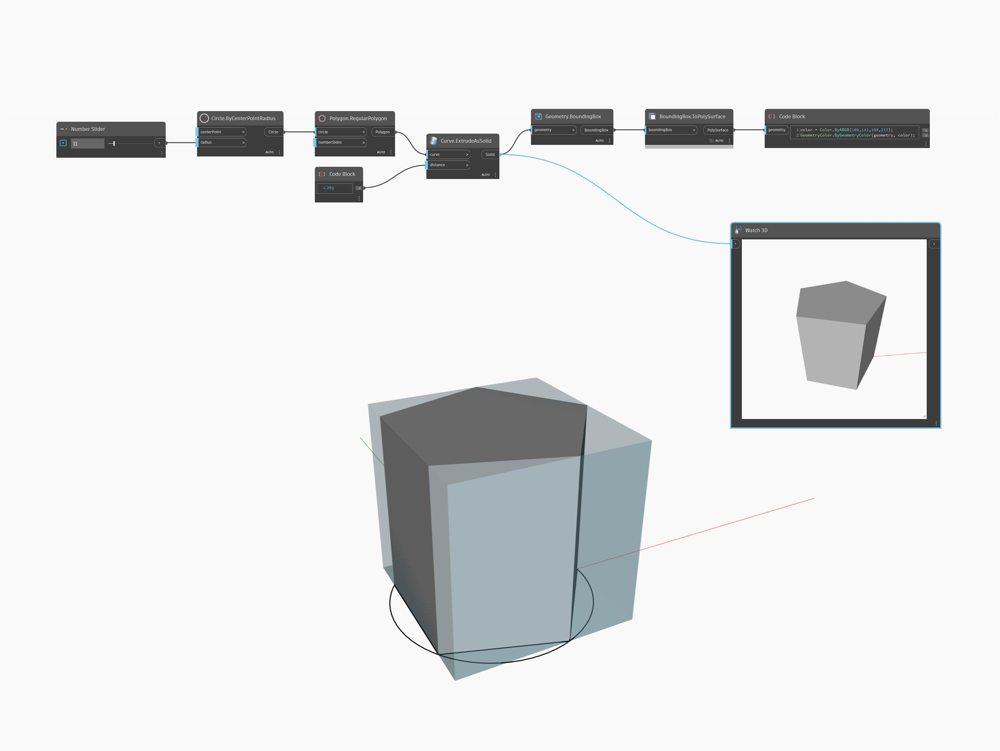

## In Depth
Watch 3D will preview the geometry output of a node in a new workspace window. In the example below, a Solid is previewed in the Watch3D node while its PolySurface bounding box is previewed in the workspace.
___
## Example File

