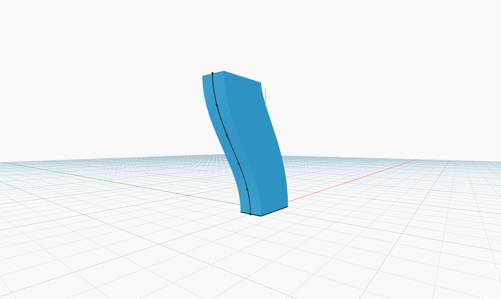

<!--- Autodesk.DesignScript.Geometry.Solid.BySweep(profile, path, cutEndOff) --->
<!--- X65A3XAWWVM3XWMAZHZFLL5HTXCJAGYISLC4VHRMPHEV3MBYIRXQ --->
## In Depth
`Solid.BySweep` creates a solid by sweeping an input closed profile curve along a specified path. 

In the example below, we use a rectangle as the base profile curve. The path is created by using a cosine function with a sequence of angles to vary the x-coordinates of a set of points. The points are used as the input to a `NurbsCurve.ByPoints` node. We then create a solid by sweeping the rectangle along the created cosine curve.
___
## Example File

