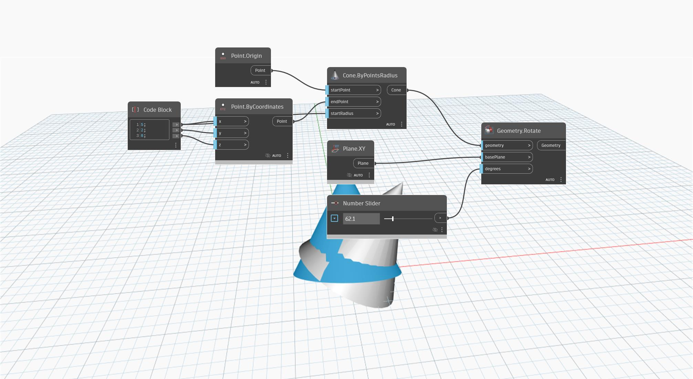

<!--- Autodesk.DesignScript.Geometry.Geometry.Rotate(geometry, basePlane, degrees) --->
<!--- XFRRMCMTIOHR6PV6TSFT3WDOBWKWHFMLXAMO7W5HDBP47YU5C2WQ --->
## In Depth
`Geometry.Rotate (basePlane, degrees)` rotates an input geometry around an origin point and axis vector by a given degree. 

In the example below, a cone is rotated about the Y-axis vector by its end point.

___
## Example File

