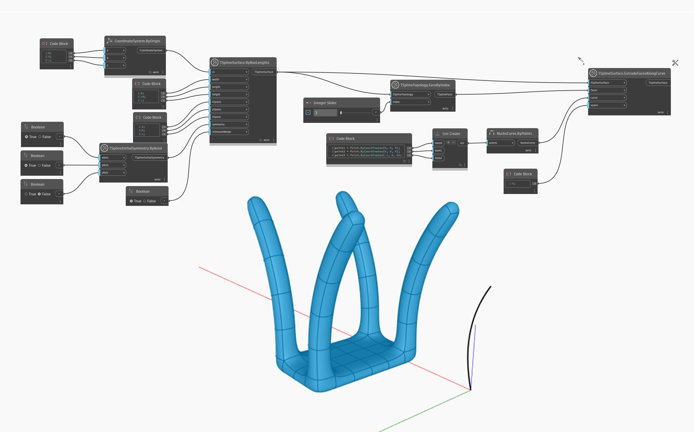

<!--- Autodesk.DesignScript.Geometry.TSpline.TSplineSurface.ExtrudeFacesAlongCurve --->
<!--- XTER6KGCJ3OP43RH5L4IEBVIW7JTSDB46DYI7BVE2UMG3DXB7HLQ --->
## In Depth
In the example below, a single face of a box T-Spline surface is selected using `TSplineTopology.FaceByIndex` node. The face is then extruded following a provided `curve` with the `TSplineSurface.ExtrudeFacesAlongCurve` node. The result is a shape with four extruded faces - which is explained by the initial symmetry applied to the shape. 
___
## Example File

