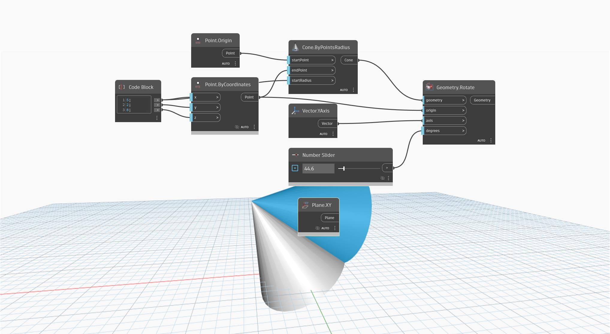

<!--- Autodesk.DesignScript.Geometry.Geometry.Rotate(geometry, origin, axis, degrees) --->
<!--- Z62AE2MAWASIXXZ7HW3OJ37OGY24A3M2KOTCHO7DR52NRIL2JQCA --->
## In Depth
`Geometry.Rotate (origin, axis, degrees)` rotates an input geometry around a base plane by a defined degree. 

In the example below, a cone is rotated around the XY plane with a number slider.

___
## Example File

