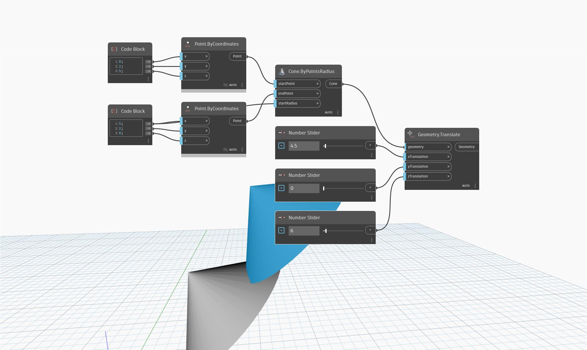

<!--- Autodesk.DesignScript.Geometry.Geometry.Translate(geometry, xtranslation, ytranslation, ztranslation) --->
<!--- Z7RCGSZ7PG327WNJNF5LAVZMVCYSSBNPUFE666HLMLY4QCDT4TDQ --->
## In Depth
`Geometry.Translate (xTranslation, yTranslation, zTranslation)` moves input geometry according to given displacements along the X, Y, and Z axes. 

In the example below, a cone is moved in the X and Z axis directions by a distance controlled by number sliders.
___
## Example File

