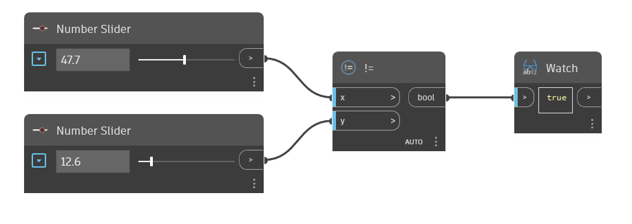

## En detalle:
El nodo `!=` es equivalente al operador "No es igual a". Se utiliza con dos valores de entrada y devuelve "True" (verdadero) si los dos valores no son iguales y "False" (falso) si los dos son iguales.

En el ejemplo siguiente, se utiliza un nodo `!=` para determinar si los dos valores de entrada no son iguales. Utilizamos dos controles deslizantes de número para gestionar las entradas del operador `!=`.
___
## Archivo de ejemplo

