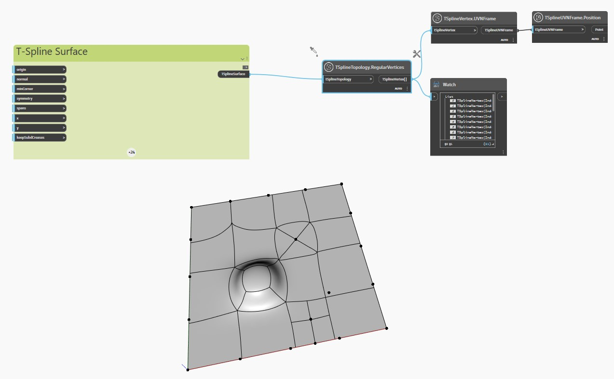

<!--- Autodesk.DesignScript.Geometry.TSpline.TSplineTopology.RegularVertices --->
<!--- 3FD66JH7OUVHRJOXDSO6GCVCZV63VG7PUZEMJMDZBM67ASM2XLRA --->
## En detalle:
En el ejemplo siguiente, se inspecciona una superficie plana de T-Spline con caras y vértices extruidos, subdivididos y estirados con el nodo `TSplineTopology.StarPointVertices`.

Los nodos `TSplineVertex.UVNFrame` y `TSplineUVNFrame.Position` se utilizan para resaltar los vértices normales de la superficie.
___
## Archivo de ejemplo

