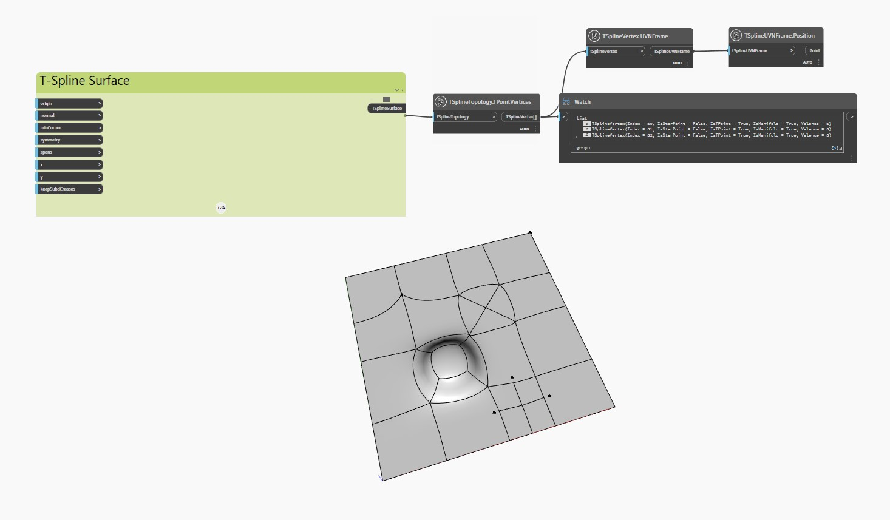

<!--- Autodesk.DesignScript.Geometry.TSpline.TSplineTopology.TPointVertices --->
<!--- 3JL6REDTXILJYKG3YL47NDNEA5YHNLEAYOO3JNMRUUBMWI4GDGHA --->
## En detalle:
En el ejemplo siguiente, se inspecciona una superficie de T-Spline plana con caras y vértices extruidos, subdivididos y estirados con el nodo `TSplineTopology.TPointVertices` para comprobar si alguno de sus vértices son puntos T.

Los nodos `TSplineVertex.UVNFrame` y `TSplineUVNFrame.Position` se utilizan para resaltar los puntos T de la superficie.

___
## Archivo de ejemplo

