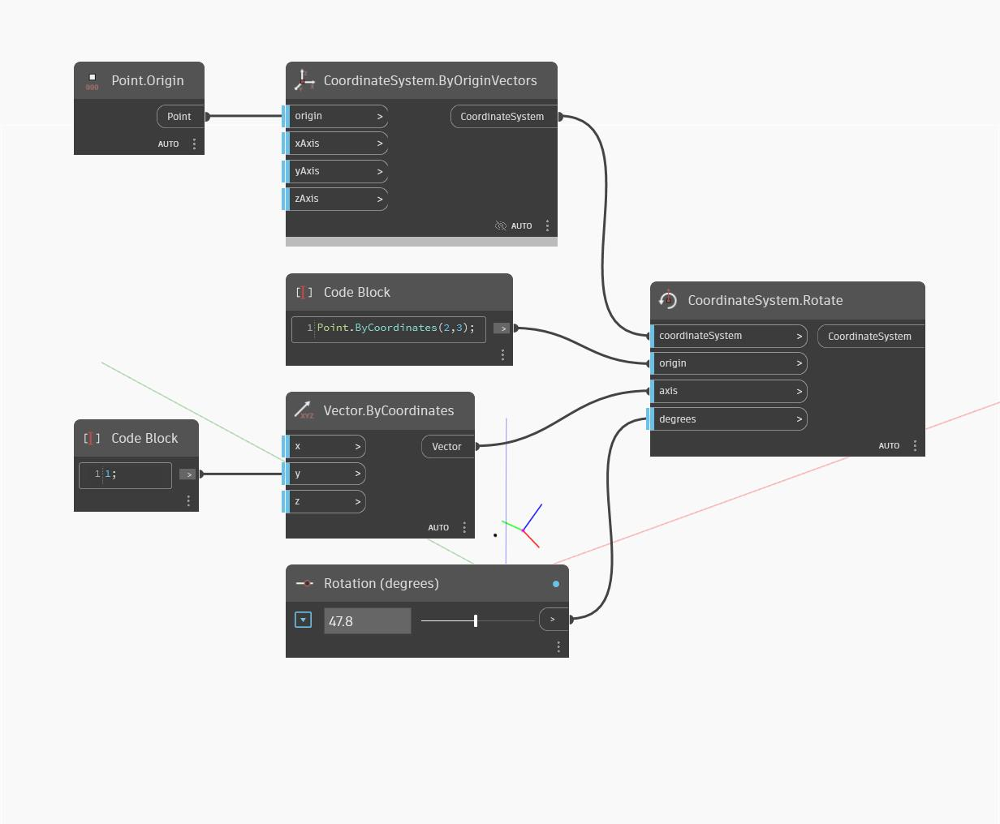

<!--- Autodesk.DesignScript.Geometry.CoordinateSystem.Rotate(origin, axis, degrees) --->
<!--- 3JO6UW566EG3MSCU25AGJTTDKZSMAZZO7D4VC5APLFDZVUEMPDSA --->
## En detalle:
Rota un sistema de coordenadas alrededor de un origen y un eje en un grado especificado.
___
## Archivo de ejemplo

