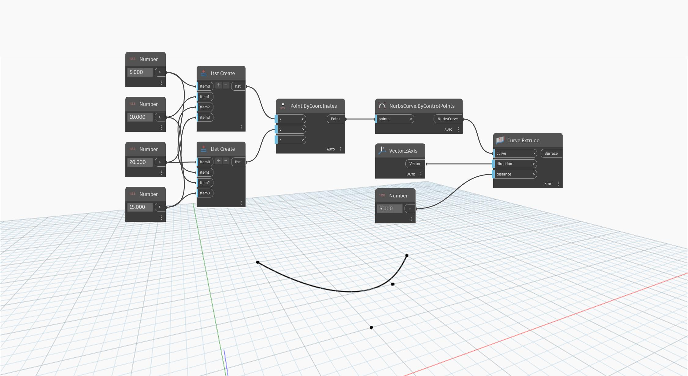

<!--- Autodesk.DesignScript.Geometry.Curve.Extrude(curve, direction, distance) --->
<!--- 5NB3FDYBJDTGURCB4X7W2I7P2TIGXAXPEUVWUMM2BTWHJ3GXRJQA --->
## En detalle:
`Curve.Extrude (curve, direction, distance)` extruye una curva de entrada mediante un vector de entrada para determinar la dirección de la extrusión. Se utiliza una entrada `distance` independiente para la distancia de extrusión.

En el ejemplo siguiente, creamos primero una NurbsCurve mediante un nodo `NurbsCurve.ByControlPoints` con un conjunto de puntos generados aleatoriamente como entrada. Se utiliza un bloque de código para especificar los componentes X, Y y Z del nodo `Vector.ByCoordinates`. Este vector se utiliza como entrada "direction" del nodo `Curve.Extrude`, mientras que se utiliza un `number slider` para determinar la entrada `distance`.
___
## Archivo de ejemplo

