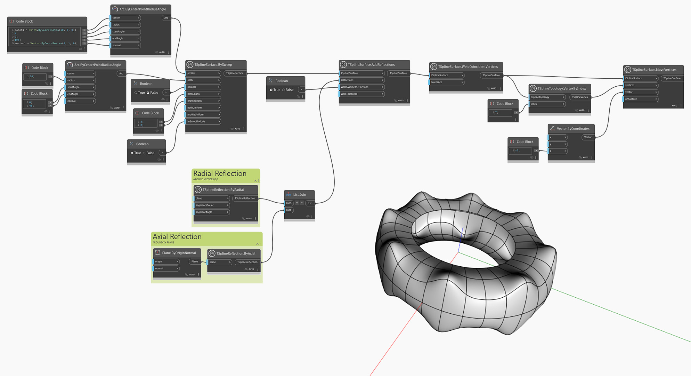

<!--- Autodesk.DesignScript.Geometry.TSpline.TSplineSurface.AddReflections --->
<!--- 6YGBDRGYLRW3BW4XJHLHBBRSCHYWA2UCJ5FQAESHDY2HMUBDUSLQ --->
## In-Depth
`TSplineSurface.AddReflections` crea una nueva superficie de T-Spline mediante la aplicación de una o varias reflexiones a la entrada `tSplineSurface`. La entrada booleana `weldSymmetricPortions` determina si las aristas plegadas generadas por la reflexión se suavizan o se conservan.

En el ejemplo siguiente, se muestra cómo añadir varias reflexiones a una superficie de T-Spline mediante el nodo `TSplineSurface.AddReflections`. Se crean dos reflexiones: axial y radial. La geometría base es una superficie de T-Spline en forma de barrido con la ruta de un arco. Las dos reflexiones se unen en una lista y se utilizan como entrada para el nodo `TSplineSurface.AddReflections`, junto con la geometría base que se va a reflejar. Las TSplineSurfaces se sueldan, lo que da como resultado una TSplineSurface lisa y sin aristas. La superficie se modifica aún más desplazando un vértice mediante el nodo `TSplineSurface.MoveVertex`. Debido a la reflexión que se aplica a la superficie de T-Spline, el desplazamiento del vértice se reproduce 16 veces.

## Archivo de ejemplo

