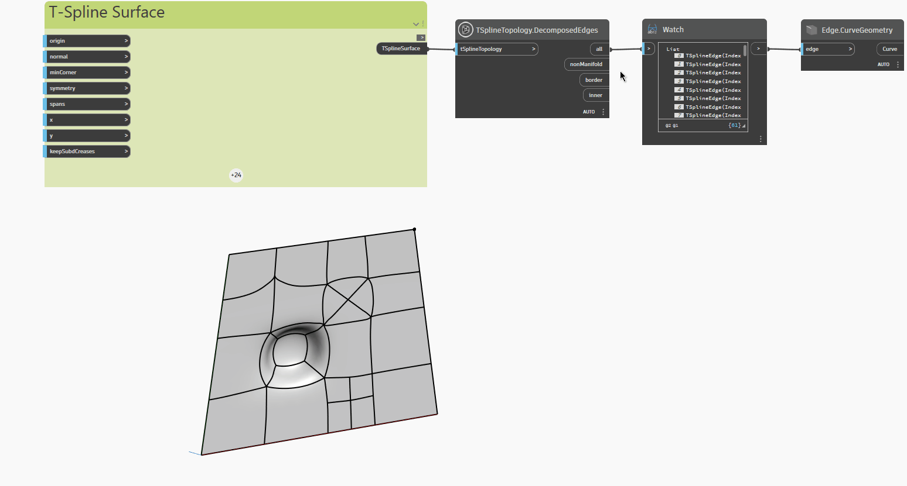

<!--- Autodesk.DesignScript.Geometry.TSpline.TSplineTopology.DecomposedEdges --->
<!--- 7LMFKLQNCV53W7KLS5QWD3E27NGGA33QPHSXMUGH323WVXWJY3GQ --->
## En detalle:
En el ejemplo siguiente, una superficie de T-Spline plana con caras y vértices extruidos, subdivididos y estirados se inspecciona con el nodo `TSplineTopology.DecomposedEdges`, que devuelve una lista de los siguientes tipos de aristas incluidas en la superficie de T-Spline:

- `all`: lista de todas las aristas.
- `nonManifold`: lista de aristas no múltiples.
- `border`: lista de los vértices de borde.
- `inner`: lista de aristas interiores.

El nodo `Edge.CurveGeometry` se utiliza para resaltar los distintos tipos de aristas de la superficie.
___
## Archivo de ejemplo

