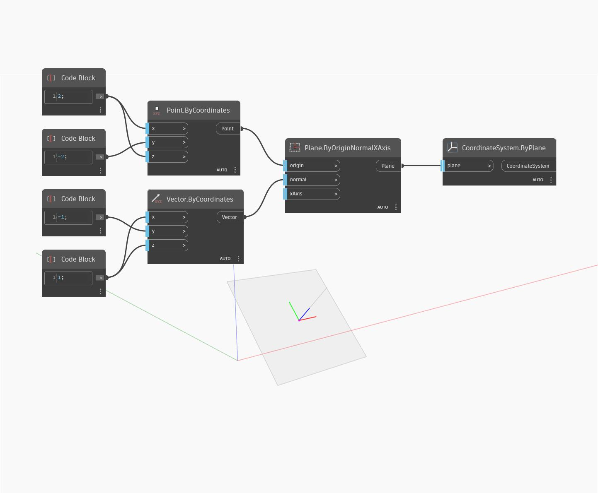

## En detalle:
`CoordinateSystem.ByPlane` devuelve un nuevo CoordinateSystem basado en un plano de entrada.

En el ejemplo siguiente, se ha reubicado la normal del plano de entrada, lo que ha generado una nuevo CoordinateSystem girado alrededor del eje X.

___
## Archivo de ejemplo

