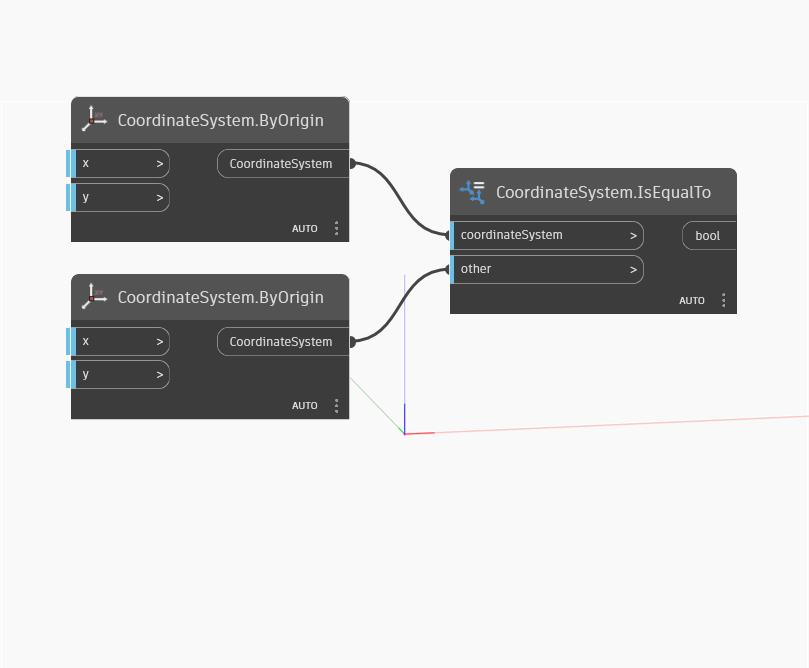

## En detalle:
IsEqualTo devolverá un valor booleano en función de si los valores de CoordinateSystems de entrada son iguales entre sí. En el siguiente ejemplo, dos CoordinateSystems con posiciones de origen positivas y negativas idénticas se transfieren a través de IsEqualTo, lo que devuelve un valor booleano "false" (falso). Sin embargo, al invertir el CoordinateSystem positivo, se devuelve un valor booleano "true" (verdadero) desde IsEqualTo porque sus valores X e Y del punto de origen ahora son negativos.
___
## Archivo de ejemplo

