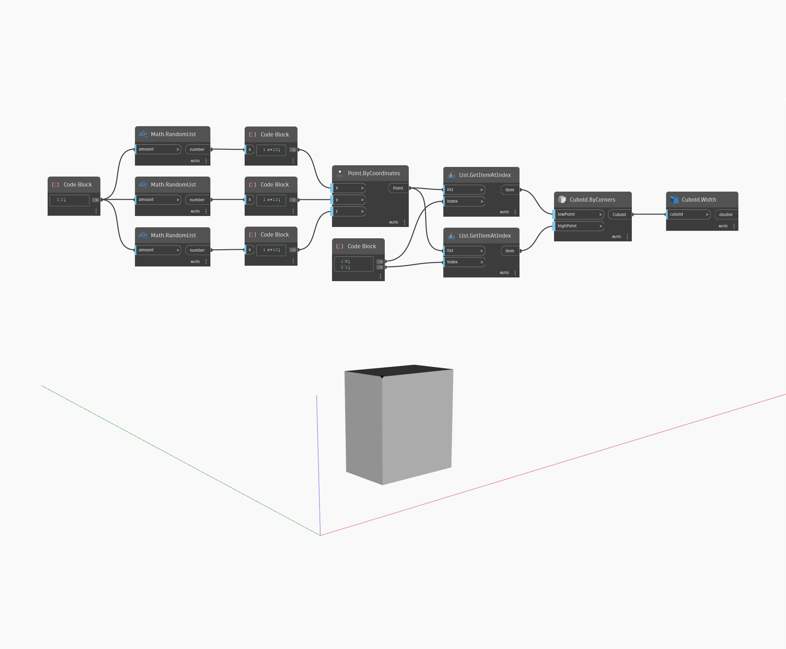

## En detalle:
`Cuboid.Width` devuelve la anchura del ortoedro de entrada.

En el ejemplo siguiente, generamos un ortoedro por esquinas y, a continuación, utilizamos el nodo `Cuboid.Width` para buscar su anchura. Tenga en cuenta que si el ortoedro se ha transformado en un sistema de coordenadas diferente con un factor de escala, devolverá la cota original del ortoedro, no las cotas del espacio universal.

___
## Archivo de ejemplo

