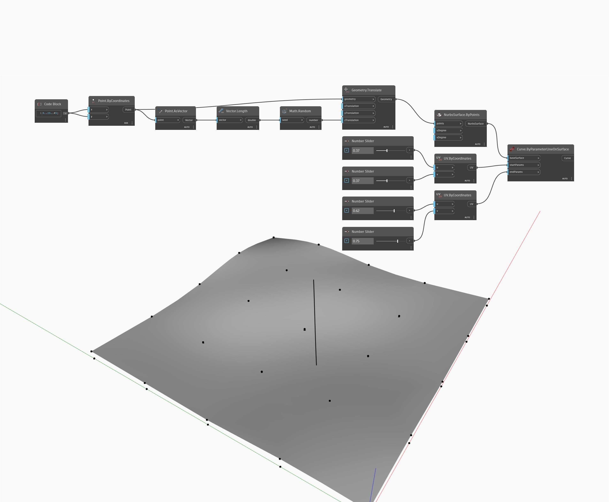

## En detalle:
Curve.ByParameterLineOnSurface creará una línea a lo largo de una superficie entre dos coordenadas UV de entrada. En el siguiente ejemplo, se crea primero una rejilla de puntos y se traslada en la dirección Z por una cantidad aleatoria. Estos puntos se utilizan para crear superficies mediante un nodo NurbsSurface.ByPoints. Esta superficie se utiliza como la baseSurface de un nodo ByParameterLineOnSurface. Un conjunto de controles deslizantes de número permite ajustar las entradas U y V de dos nodos UV.ByCoordinates, que se utilizan a continuación para determinar los puntos inicial y final de la línea en la superficie.
___
## Archivo de ejemplo

