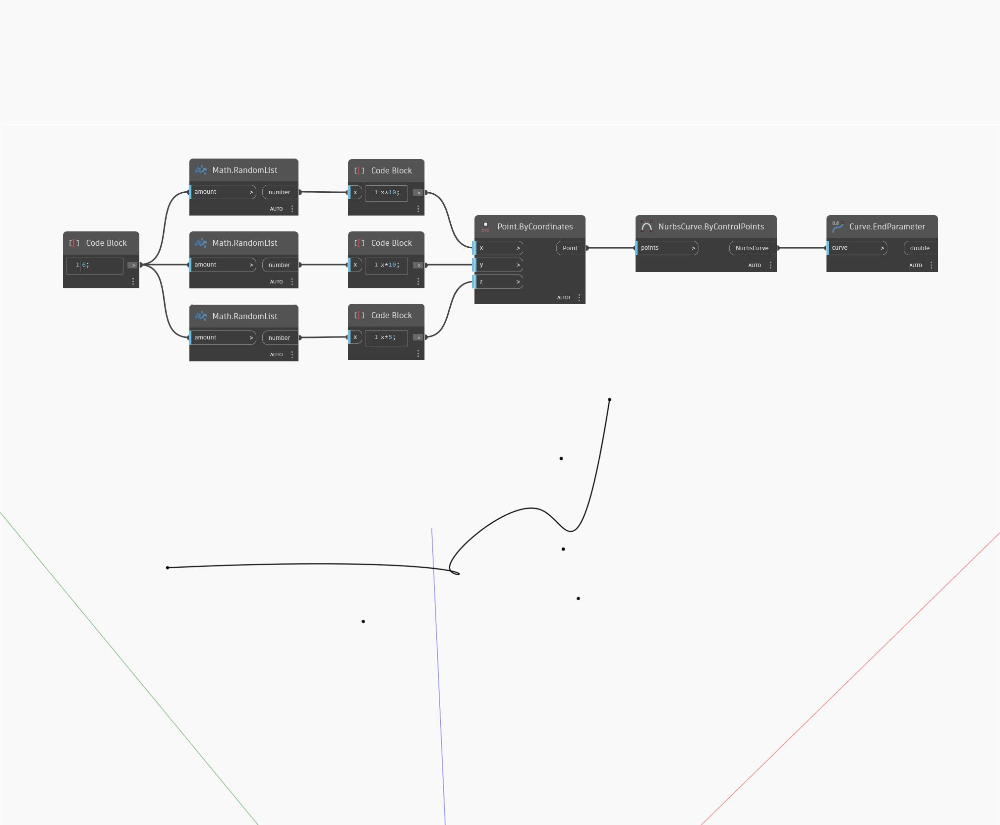

## En detalle:
EndParameter devolverá un número que represente el final del dominio en el que se puede evaluar la curva de entrada. En la mayoría de los casos, el parámetro final será 1. En el siguiente ejemplo, se utiliza primero una curva NURBS mediante un nodo ByControlPoints con un conjunto de puntos generados aleatoriamente como entrada. Esta curva se utilizará como entrada para un nodo EndParameter.
___
## Archivo de ejemplo

