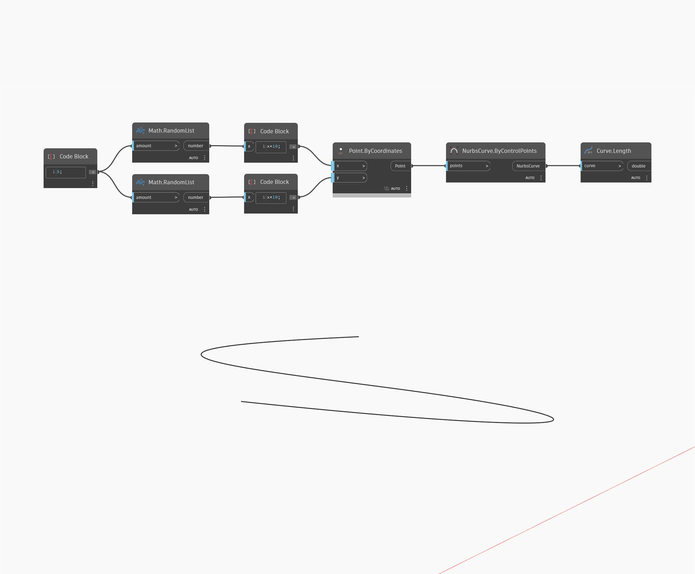

## En detalle:
`Curve.Length` devuelve la longitud de una curva de entrada.

En el ejemplo siguiente, creamos primero una NurbsCurve mediante el nodo `NurbsCurve.ByControlPoints` con un conjunto de puntos generados aleatoriamente como entrada. Podemos buscar la longitud de esta curva mediante el nodo `Curve.Length`.

___
## Archivo de ejemplo

