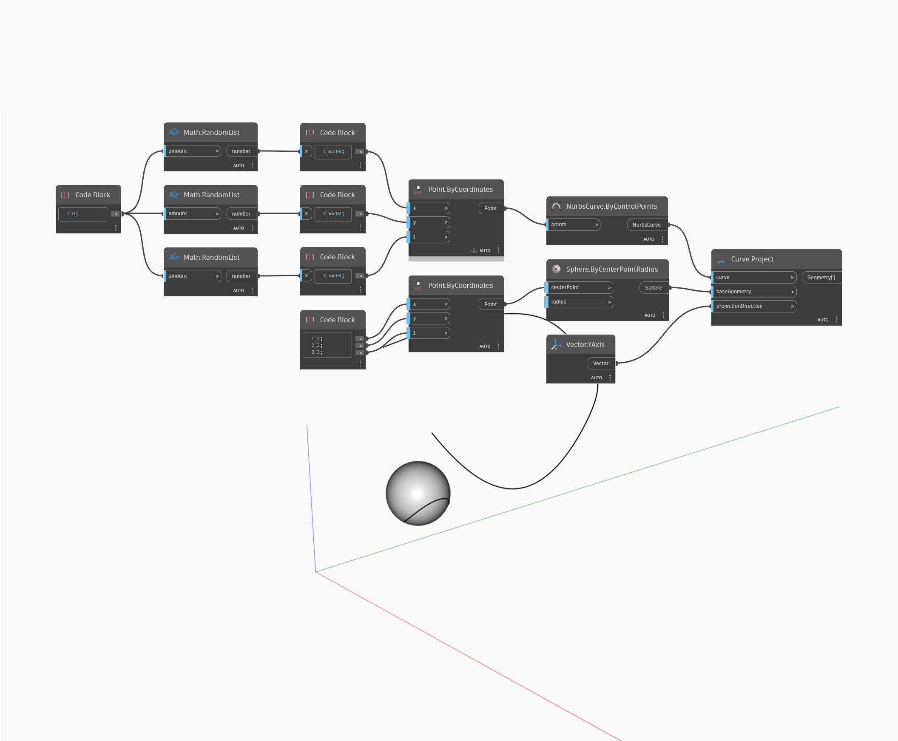

## En detalle:
Project proyectará un punto a lo largo de una dirección de vector determinada sobre una geometría especificada. Solo se intenta realizar la proyección en la dirección positiva del vector. Si el vector no se interseca con la geometría especificada, se devolverá "null" (nulo). En el siguiente ejemplo, se crea un punto mediante un bloque de código para especificar las coordenadas X, Y y Z. Se utiliza una esfera como geometría para proyectar sobre ella y el xAxis universal como dirección de proyección. La salida es un punto en la superficie de la esfera que se proyecta desde el punto original.
___
## Archivo de ejemplo

