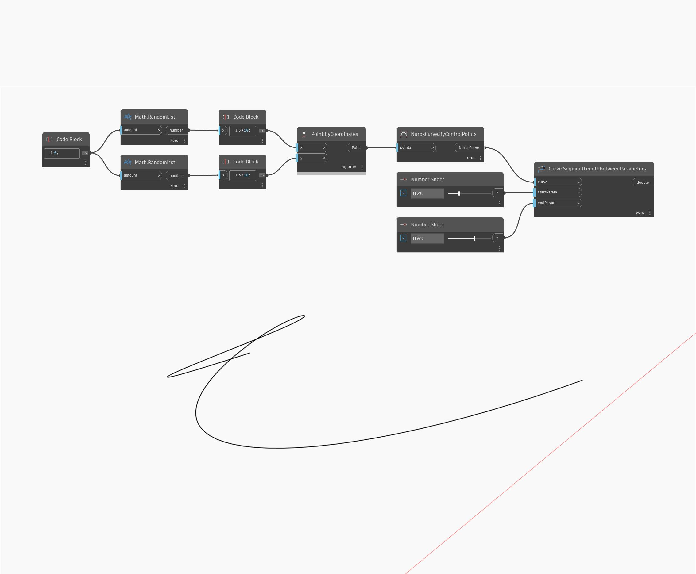

## En detalle:
SegmentLengthBetweenParameters devolverá la longitud de una curva entre el parámetro inicial de entrada y el parámetro final de entrada, donde un valor de 0 es el parámetro al principio de la curva y un valor de 1 es el parámetro al final de la curva. En el siguiente ejemplo, se utilizan dos conjuntos de números aleatorios para generar una lista de puntos. Estos puntos se utilizan para crear una curva NURBS mediante puntos de control. Se usan dos controles deslizantes de número establecidos en el rango de 0 a 1 para las entradas de los parámetros en un nodo SegmentLengthBetweenParameters.
___
## Archivo de ejemplo

