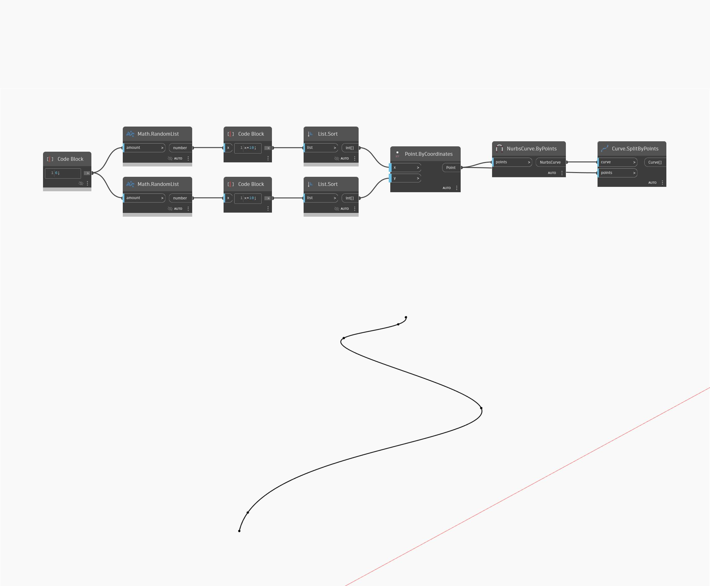

## En detalle:
SplitByPoints dividirá una curva de entrada en los puntos especificados y devolverá una lista de segmentos resultantes. Si los puntos especificados no se encuentran en la curva, este nodo buscará los puntos a lo largo de la curva más cercanos a los puntos de entrada y dividirá la curva en los puntos resultantes. En el siguiente ejemplo, se crea primero una curva NURBS mediante un nodo ByPoints con un conjunto de puntos generados aleatoriamente como entrada. El mismo conjunto de puntos se utiliza como lista de puntos en un nodo SplitByPoints. El resultado es una lista de segmentos de curva entre los puntos generados.
___
## Archivo de ejemplo

