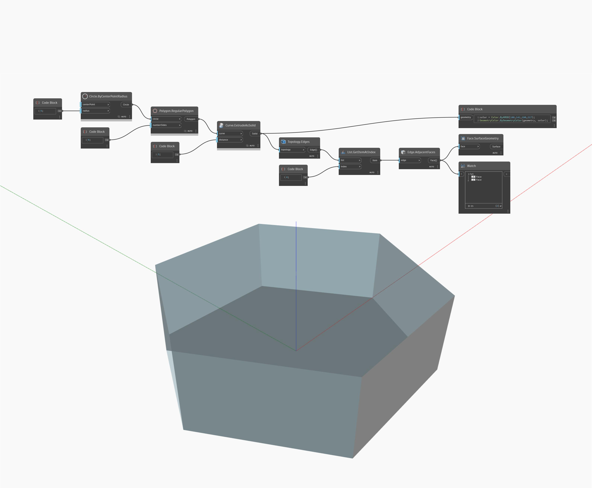

## En detalle:
AdjacentFaces devolverá las caras adyacentes a un vértice de entrada. En el siguiente ejemplo, un vértice de un ortoedro devolverá una lista de tres caras. Al ajustar el control deslizante de selector de índice, se cambiará el vértice de entrada y se devolverán diferentes conjuntos de caras adyacentes. Las caras se representan como superficies.
___
## Archivo de ejemplo

