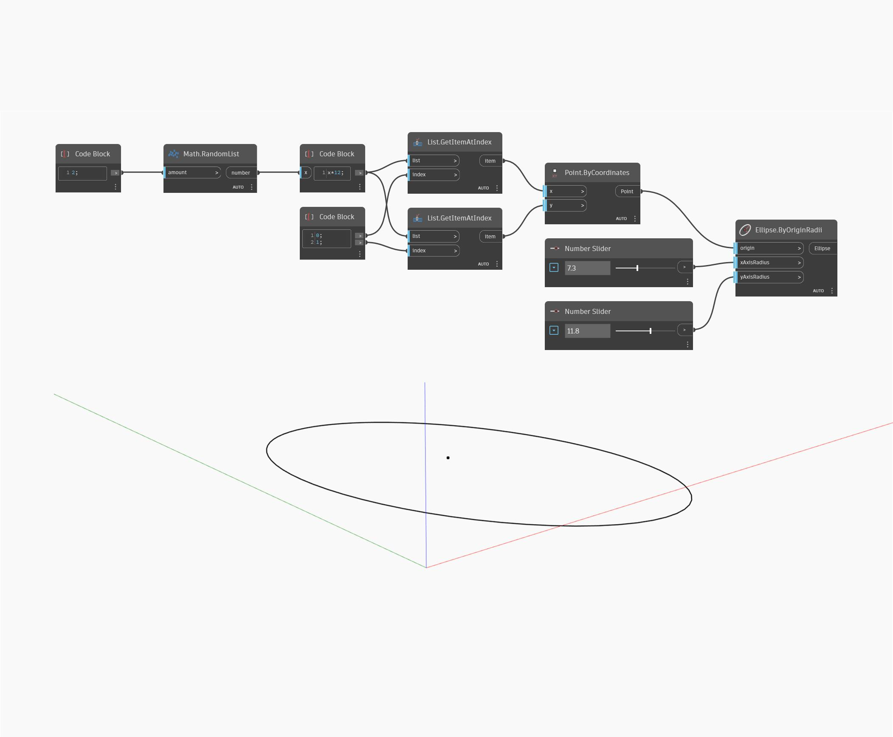

## En detalle:
Ellipse.ByOriginRadii crea una elipse centrada en el punto de origen de entrada y presenta un radio X e Y a partir de los valores de entrada xAxisRadius e yAxisRadius. Esta elipse se alineará con el plano XY universal. En el siguiente ejemplo, se generan dos números aleatorios para crear un punto de origen y, a continuación, se utilizan dos controles deslizantes de número para los radios de los ejes X e Y.
___
## Archivo de ejemplo

