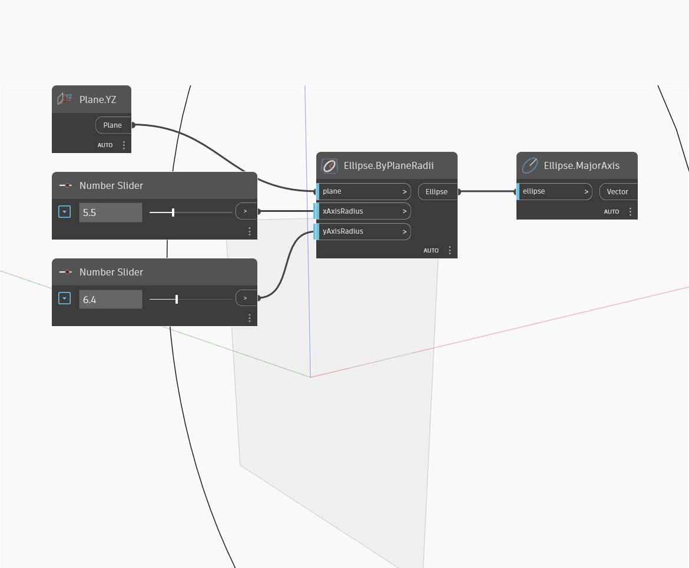

## En detalle:
MajorAxis devolverá la longitud de los dos ejes de la elipse. El eje se genera como un vector, que tiene una magnitud igual al mayor de los dos radios. Tenga en cuenta que los ejes mayor y menor están determinados por la longitud, no por la dirección. Es decir, el eje mayor se puede corresponder con el xAxisRadius de una elipse, pero con el yAxisRadius de una elipse diferente. En el ejemplo, se crea primero un arco de elipse mediante el plano XY y una serie de controles deslizantes de número. A continuación, se usa MajorAxis para extraer el eje principal de la elipse.
___
## Archivo de ejemplo

