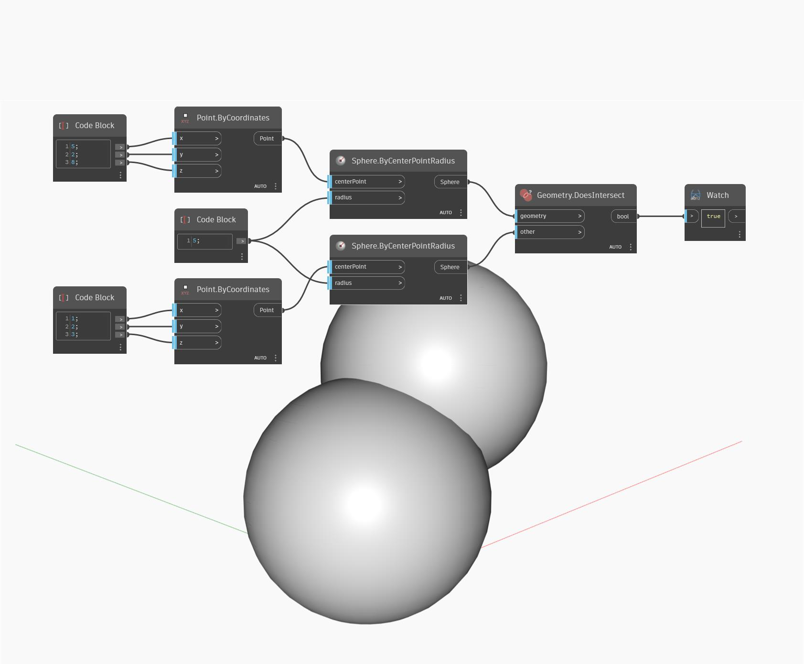

## En detalle:
Geometry.DoesIntersect comprueba si hay una intersección de dos geometrías. Si los objetos se intersecan, el nodo devolverá "True" (verdadero). En este ejemplo, se comprueba si hay una intersección de dos geometrías de esfera.
___
## Archivo de ejemplo

