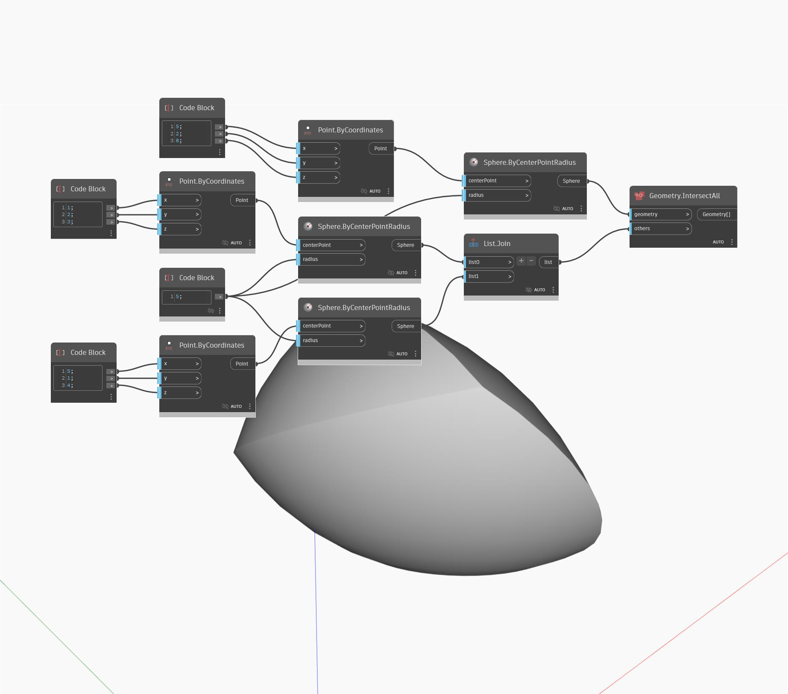

## En detalle:
Geometry.IntersectAll busca la geometría de intersección que comparten cualquier número de objetos de geometría. En este ejemplo, la intersección de tres esferas devuelve una PolySurface, también conocida como intersección de sólidos.
___
## Archivo de ejemplo

