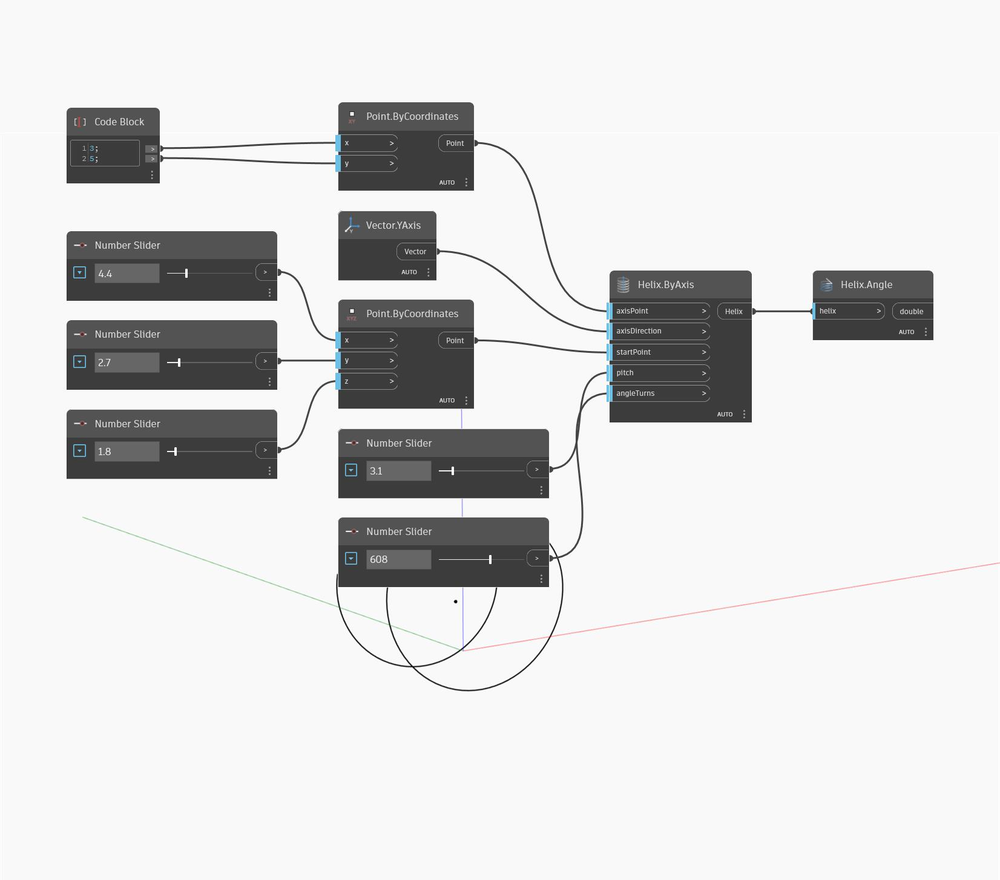

## En detalle:
Angle buscará la longitud angular total de una hélice en grados, donde un giro completo es igual a 360. En el siguiente ejemplo, se crea una hélice mediante Helix.ByAxis y, a continuación, se usa Angle para buscar el ángulo total de la hélice.
___
## Archivo de ejemplo

