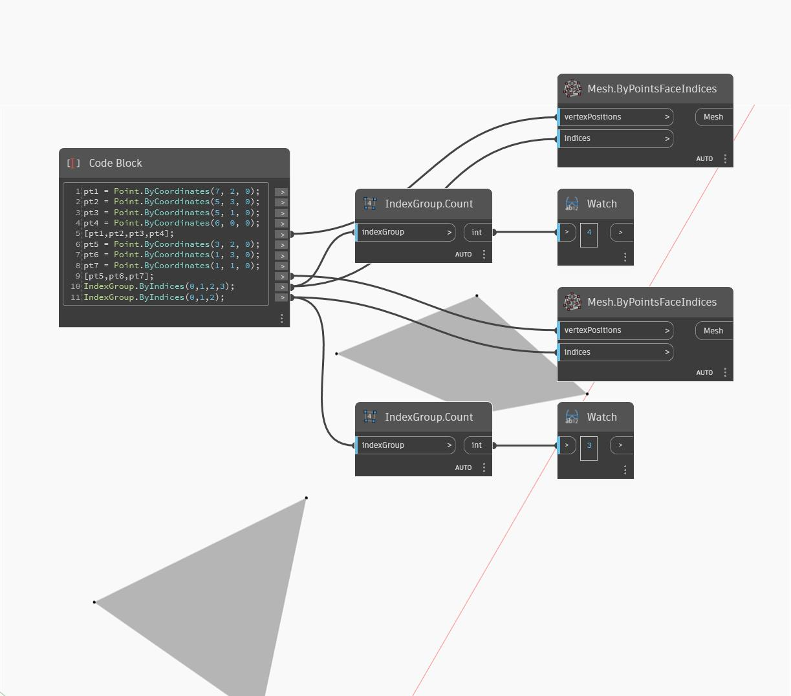

## En detalle:
Count devolverá un entero que representa el número de índices de un IndexGroup. En el siguiente ejemplo, se devuelven recuentos de índices para caras de malla con tres y cuatro bordes.
___
## Archivo de ejemplo

