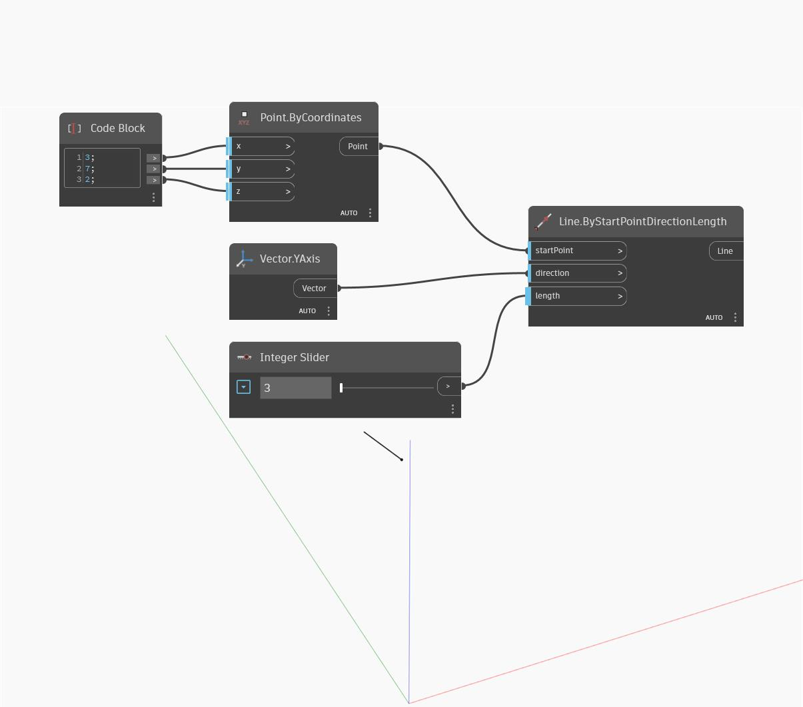

## En detalle:
Line.ByStartPointDirectionLength crea una línea que comienza en la entrada startPoint, y con una longitud y una dirección según el vector y la longitud de la dirección de entrada. En el siguiente ejemplo, se utiliza un bloque de código para especificar las coordenadas X, Y y Z de un punto. A continuación, se usa un control deslizante de número para ajustar la longitud de la línea.
___
## Archivo de ejemplo

