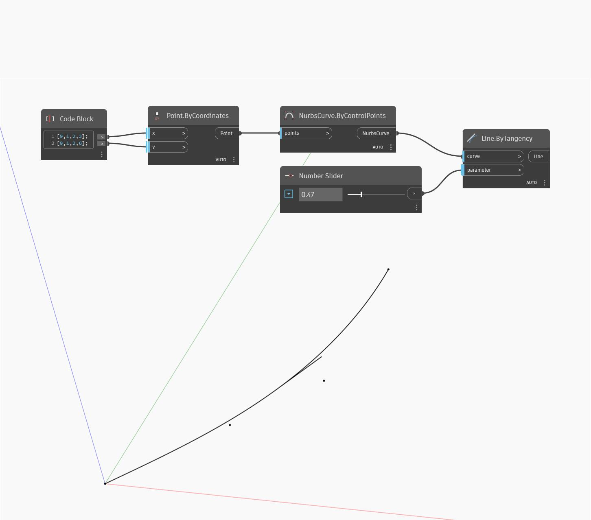

## En detalle:
Line.ByTangency crea una línea tangente a una curva de entrada y con una longitud de 1 unidad. La entrada del parámetro especifica la posición a lo largo de la curva que se va a evaluar con un valor 0 como inicio de la curva y un valor 1 como final. En el ejemplo, se utiliza un bloque de código para generar dos listas correspondientes a las ubicaciones X e Y de una serie de puntos. Los puntos se utilizan para dibujar una curva NURBS. A continuación, se utiliza un control deslizante de número entre 0 y 1 como parámetro de entrada para crear una línea tangente a la curva.
___
## Archivo de ejemplo

