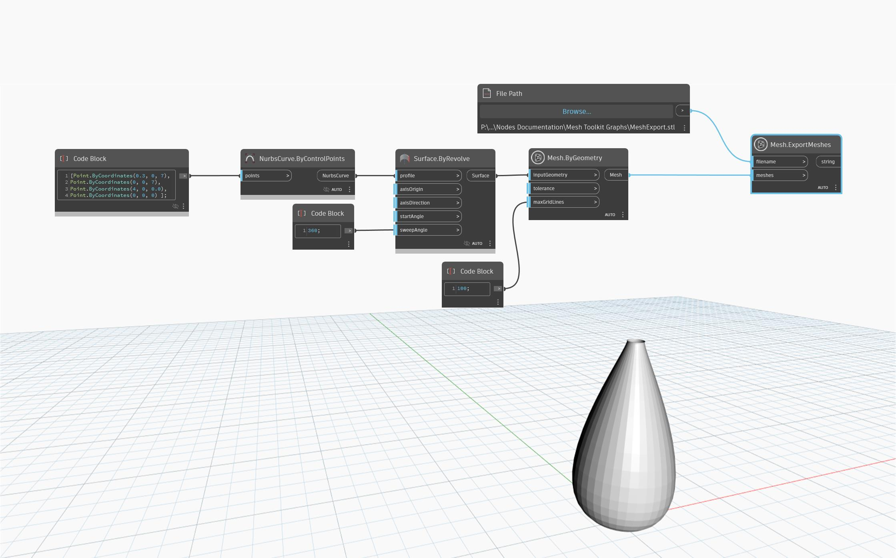

## En detalle
`Mesh.ExportMeshes` exporta la malla a un formato de archivo. El tipo de malla que se exportará viene determinado por la extensión del nombre de archivo; por ejemplo, un nombre de archivo que termine en ".stl" se exportará en formato STL, como en el siguiente ejemplo.
Se admiten los siguientes formatos:
- .mix: Meshmixer
- .obj: Wavefront OBJ
- .stl: formato STL
- .dae: COLLADA
- .ply: formato de archivo de polígono

## Archivo de ejemplo

